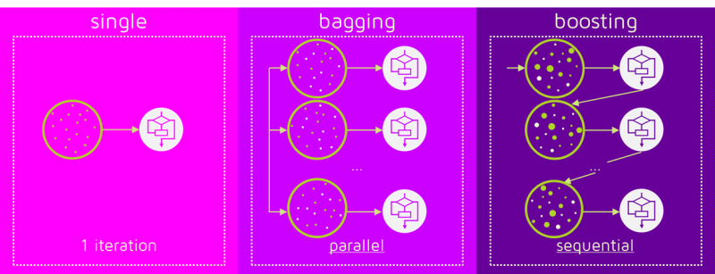

# LANL-Earthquake-Prediction

## Introduction

This project is an on-going kaggle competition, aiming at forecasting earthquakes. it is one of the most important problems in Earth science to precise because of the devastating consequences of earthquakes.  
In earthquake prediction, there are three key points: **when**, **where**, **how long**. Our topic focus on **when** the earthquake will happen.

## Preliminary

In pre-proposal, our goals are:

- [ ] prize
- [x] learn some machine learning algorithms
- [x] experience with scikit-learn, TensorFlow and PyTorch

We decided to use _support vector regressor_, _hidden Markov model_, _random forest_ and _recurrent neural network_. Besides, after getting the results of these models, we will choose to apply boosting to get better prediction accuracy.

## State of the Art

> TODO

## Data

The data is stored in a csv format file, and there are two columns: `acoustic data` and `time to failure`, indicating the data collected from experimental earthquake and the remaining time to next earthquake. The size of data is enormous (8.9GB), so to get an overview of data, we down-sample the data with a span of 300 and draw the curve shown below.

### Visualization

Each peak of red line correspond to a zero value in blue line, indicating an earthquake happens

### Features

Here are some statistic features extracted from the raw data, including mean, mode, standard deviation etc.

> TODO: 
> - explain `kurtosis`, `skew`, `quantile`

|mean|mode| std| min| max|kurtosis|skew|quantile|
|:--:|:--:|:--:|:--:|:--:|:------:|:--:|:------:|
|4.61|3.0|3.14710144|-5|15|0.322667067|0.0457427014|-3.0|
|4.91|5.0|2.69630409|-2|14|-0.135646084|0.120890874|-1.0|
|5.10|5.0|2.76999974|-4|12|0.259263007|-0.276245047|-2.01|
|5.10|5.0|4.60616014|-10|16|-0.130017036|-0.229876373|-6.0|
|5.17|6.0|4.23461870|-5|16|-0.377477283|0.0850487395|-4.0|
|5.56|7.0|4.30127797|-7|19|0.0650931512|0.0510493822|-4.0|
|5.05|7.0|3.82709346|-5|15|-0.413551741|0.0889817181|-3.0|
|5.28|6.0|17.8110183|-41|64|1.17986709|0.0737194603|-38.0|
|5.05|1.0|12.0677223|-27|34|-0.452584126|-0.0185136062|-23.02|
|5.04|4.0|6.66002819|-11|22|-0.411249801|0.168935276|-9.01|

## Method

### Support Vector Machine (baseline)

Every experiments have baseline, we choose support vector machine as baseline model. Support vector machine is a deterministic classification model, using support vector to get the decision boundary that has a largest margin to nearest data. It can also be used as a regression method, maintaining all the main features that characterize the algorithm.  
Original support vector regression is a linear model. To extend it to fit non-linear functions, kernel functions are introduced. Kernel is first proposed in classification method, like the figure showing below, the data in the figure is not linear separable if we look at it from above. What kernels do is to map the data to higher dimension from which it can be differentiate by a single line or a hyperplane.

We use the support vector machine model in [scikit-learn](https://scikit-learn.org/stable/), a free software machine learning library for the Python programming language. The support vector machine implementation is based on `libsvm`, a high-efficient open source machine learning library, and apart from original support vector regressor, it provide another version of support vector machine which has a upper bound of support vectors.

> TODO: 
> - trouble we faced

### Random Forest

Random forest is an ensemble model, it is a combination of multiple decision trees and **bootstrap aggregation**, also known as **bagging**. The basic idea is to combine multiple decision trees in determining the final output, two heads are better than one.  
Each decision tree in the "forest" is a independent model. So to generate each tree, there must be some criterias to split tree into two subtrees. For classification task, the criterion can be either _entropy_ or _Gini index_; and for regression, we usually use _residual sum of squares_

$$rss = \sum_{left\_tree}(y_i-y^*_L)^2+\sum_{right\_tree}(y_i-y^*_R)^2$$

where $y^*_L$ means y-value for left node, while $y^*_R$ for right node.  
Each tree uses different data generated by bootstrapping, so it helps reduce variance. (Our data has few samples but very large amount of time steps in each earthquake sample)

> TODO:
> - organize language 
> - trouble we faced

### Recurrent Neural Network (LSTM, GRU)

Recurrent neural network is a neural network structure aiming at dealing with sequential data. Like reading a book, human will keep knowledge about previous chapters in mind while reading. So as the way how recurrent neural network works, during learning all neural cells share the same parameters and update together.  
However, the original version of recurrent neural network is facing some problems, like losing what has been learned before in the situation that the time sequence is long enough and gradient vanishing. So here comes long-short term memory (LSTM) structure. In the cell of LSTM, there are three "gates" to determine what to **forget**, what to **update** and what to **output**. After each LSTM cell there will be an output to system and a status output to next cell, and the status output will help the neural network model to keep a long-term memory.

Besides, there is another version of recurrent network named gated recurrent unit (GRU). Similar to LSTM, the main idea behind GRU is to let model learn how to keep useful long-term information while learning short-term knowledge. Also GRU has gates: **update gate** and **reset gate**.

> TODO: 
> - trouble we faced

### Boosting

Boosting is a machine learning ensemble meta-algorithm for reducing both variance and bias. Different from bagging's parallel mechanism, boosting is a sequential training process. The main idea is to train several weak learners sequentially, and give the misclassified samples higher weight, which means next learner should pay more attention to those samples to correct the mistake from its predecessor.

> TODO: 
> - more about boosting
> - trouble we faced

## Result

> TODO

## Conclusion

> TODO

## Future Work

> TODO
