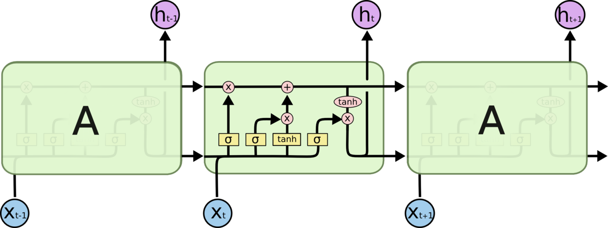
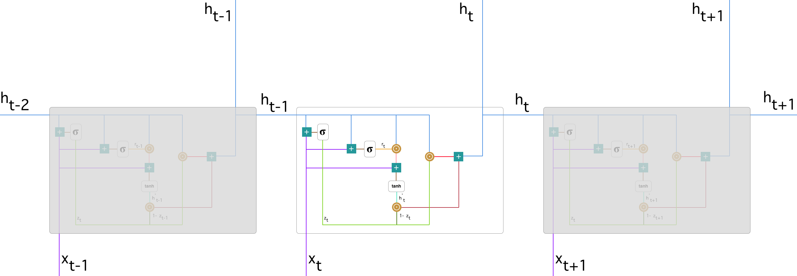
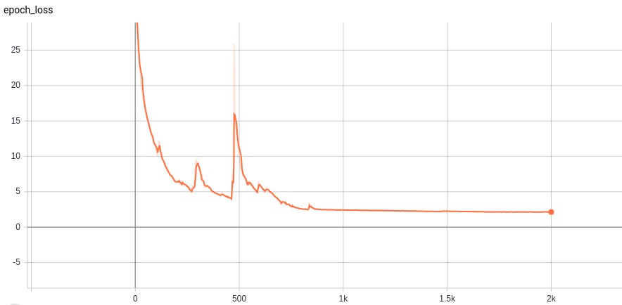

# LANL-Earthquake-Prediction

Group 4: Ruiqi Wang, Chu Qiao  
Instructor: Sunita Chandrasekaran

## Introduction

Forecasting the occurrence of a future earthquake is one of the fundamental problems in earth science because of its severe consequences. Current scientific studies related to earthquake forecasting focus on three key points: when the event will occur, where it will occur, and how large it will be. Among all the prediction tasks, the successful forecast of the next earthquake time can help to avoid society loss as much as possible.  
In this project, we will use real-time seismic data to simulate when the earthquake will occur. Multiple machine learning algorithms including Random Forest(RF) and Support Vector Regression(SVR) have been applied in previous works[2-4]. However, their methods only considered and extracted limited features from the real time seismic data which achieved unsatisfactory results. For instance, the data provided by [kaggle.com](https://www.kaggle.com/c/LANL-Earthquake-Prediction), there are only two fields given, ​acoustic signal level​ and time to failure.​ The objective of the earthquake prediction task is to learn the fluctuate pattern of the acoustic single level and further predict the possible time to failure. Due to the acoustic single data is time-related, it is intuitive to implement regression methods for the purpose of predicting the next failure time based on the current and historical acoustic single patterns. Nevertheless, only considering these limited features could not give a satisfactory prediction result since this prediction task needs more time-related features to improve the performance.  
In this project, we implement RF and SVR as the baseline models. In addition, we further consider the famous variant of the recurrent neural network - Long Short Term Memory (LSTM) in order to better capture the time-sensitive sequential feature from the real-time seismic data. To achieve this objective, we employed the Fourier transformation to each chunk of the data. After transferring the time-series data
to frequency domain, more features can be extracted.

## Preliminary

In pre-proposal, our goals are:

- [ ] prize
- [x] learn some machine learning algorithms
- [x] experience with scikit-learn, TensorFlow and PyTorch

We decided to use _support vector regressor_, _hidden Markov model_, _random forest_ and _recurrent neural network_. Besides, after getting the results of these models, we will choose to apply boosting to get better prediction accuracy.

## State of the Art

Since this project comes from a Kaggle on-going competition, there have been several solution and kernels proposed by others. As most kernels suggest that the raw data is not sufficient to accomplish the prediction task, different strategies of feature engineering are proposed. Per ​jsaguiar’s[1]​ kernel, there implements some statistic features including mean, standard deviation, max/min, kurtosis, skew and quantile. Base on these features, different machine learning models are applied, like support vector machine, linear regression and random forest[2-4]​ . Apart from extracting features by hand, some researchers choose to do end-to-end learning and use 1D convolutional neural network to automatically get features from raw data[5]​ . The model start from 1D CNN to extract features from raw data with filter size 10. Through 3 convolution layers, the model gets 16 features, then these features are feeded into several fully connected layers to get final output. Compared with these previous methods, this work uses Fourier transformation to extract more features that can not be seen in time domain.  
Apart from this competition, there have been many researchs on earthquake prediction using various features and models.

### Models

- Continuous chatter of the Cascadia subduction zone revealed by machine learning ([link](https://www.nature.com/articles/s41561-018-0274-6))
- Similarity of fast and slow earthquakes illuminated by machine learning ([link](https://www.nature.com/articles/s41561-018-0272-8#data-availability))
    - model: gradient boosted trees25 algorithm  
- Earthquake prediction model using support vector regressor and hybrid neural networks ([link](https://journals.plos.org/plosone/article?id=10.1371/journal.pone.0199004))  
- The SVR-HNN model

### Attribute

- a and b value (from well-known geophysical law known as Gutenberg-Richter law)
- Seismic energy release
- Time of n events
- Mean Magnitude
- Seismic rate changes
- Maximum magnitude in last seven days
- Probability of earthquake occurrence
- Deviation from Gutenberg-Richer law
- Standard deviation of b value
- Magnitude deficit
- Total recurrence time

## Data

The data is stored in a csv format file, and there are two columns: `acoustic data` and `time to failure`, indicating the data collected from experimental earthquake and the remaining time to next earthquake. The size of data is enormous (8.9GB), so to get an overview of data, we down-sample the data with a span of 300 and draw the curve shown below.

Here is what the raw data looks like.

|acoustic_data|time_to_failure|
|:-:|:-:|
|12|1.4690999832|
|6|1.4690999821|
|8|1.469099981|
|5|1.4690999799|
|8|1.4690999788|
|8|1.4690999777|
|9|1.4690999766|
|7|1.4690999755|
|-5|1.4690999744|
|3|1.4690999733|

### Visualization

Each peak of red line correspond to a zero value in blue line, indicating an earthquake happens.  
As we usually do to anaylize data with temporality, we apply Fourier transform. Here is the figure of one entire earthquake in frequency domain[6]. Most of time there is low frequency data, only when an earthquake happens high frequency will appear for few milliseconds.

### Features

In preliminary we under estimated the importance of feature engineering. As this is a traditional machine learning task, and the raw data is presented in time sequence, we cannot feed the data into machine learning models directly. Shown the raw data visualization, the acoustic data is dense in time steps, but the value disturbance is not significant most of time.
Here are some statistic features extracted from the raw data, including mean, mode, standard deviation etc.

- **Kurtosis**: measure of tailedness  
- **Skewness**: measure of asymmetry  
- **Quantile**: cut points that devide data  

Good features usually have low correlation between each other, which makes every attributes have different contribution to the result. So given the heatmap of our feature correlation we can see our features have low correlations.

## Method

### Random Forest (baseline)

Every experiments have baseline, we choose random forest as baseline model. Random forest is an ensemble model, it is a combination of multiple decision trees and **bootstrap aggregation**, also known as **bagging**. The basic idea is to combine multiple decision trees in determining the final output, two heads are better than one.  
Each decision tree in the "forest" is a independent model. So to generate each tree, there must be some criterias to split tree into two subtrees. For classification task, the criterion can be either _entropy_ or _Gini index_; and for regression, we usually use _residual sum of squares_

![rf1]

where ![rfl] means y-value for left node, while ![rfr] for right node.  
Each tree uses different data generated by bootstrapping, so it helps reduce variance. (Our data has few samples but very large amount of time steps in each earthquake sample)

### Support Vector Machine

Support vector machine is a deterministic classification model, using support vector to get the decision boundary that has a largest margin to nearest data. It can also be used as a regression method, maintaining all the main features that characterize the algorithm.  
Original support vector regression is a linear model. To extend it to fit non-linear functions, kernel functions are introduced. Kernel is first proposed in classification method, like the figure showing below, the data in the figure is not linear separable if we look at it from above. What kernels do is to map the data to higher dimension from which it can be differentiate by a single line or a hyperplane.

We use the support vector machine model in [scikit-learn](https://scikit-learn.org/stable/), a free software machine learning library for the Python programming language. The support vector machine implementation is based on `libsvm`, a high-efficient open source machine learning library, and apart from original support vector regressor, it provide another version of support vector machine which has a upper bound of support vectors, which is a way to do regularization on the model.

### Recurrent Neural Network (LSTM, GRU)

Recurrent neural network is a neural network structure aiming at dealing with sequential data. Like reading a book, human will keep knowledge about previous chapters in mind while reading. So as the way how recurrent neural network works, during learning all neural cells share the same parameters and update together.  
However, the original version of recurrent neural network is facing some problems, like losing what has been learned before in the situation that the time sequence is long enough and gradient vanishing. So here comes long-short term memory (LSTM) structure. In the cell of LSTM, there are three "gates" to determine what to **forget**, what to **update** and what to **output**. After each LSTM cell there will be an output to system and a status output to next cell, and the status output will help the neural network model to keep a long-term memory.

Besides, there is another version of recurrent network named gated recurrent unit (GRU). Similar to LSTM, the main idea behind GRU is to let model learn how to keep useful long-term information while learning short-term knowledge. Also GRU has gates: **update gate** and **reset gate**.

## Result

### Random Forest

In this project, we used sklearn to implement Random Forest regressor, and apply grid search to find the best hyperparameter set.

- bootstrap: a method to pick a subset of the training set with replacement. The purpose is to use different to construct each individual decision tree.
- max_depth: the maximum number of depth of each decision tree
- max_features: number of features used to generate trees
- n_estimators: total number of trees inside this RF

In this case, `max_features` is using `log2`, which means the features for decision trees are redundant.  
The mean absolute error for Random Forest with hyperparameters shown above is approximate 3.67

### SVR

We did grid search for SVR with 5-fold validation to find the optimal hyperparameters. For support vector regressor with restriction on support vectors, we provide different value for parameter `nu`, number of support vectors, and `C`, penalty of error term.

|nu \ C| 0.2| 0.4| 0.6| 0.8| 1.0|
|:-:|:-:|:-:|:-:|:-:|:-:|
|**0.25**|2.94|2.82|2.76|2.73|2.71|
|**0.5**|2.69|2.62|2.58|2.55|2.53|
|**0.75**|2.58|2.53|2.50|2.47|2.45|
|**1.0**|2.57|2.51|2.47|2.44|2.42|

So the final hyperparameters we choose are `nu = 1.0` `C = 1.0`, and in that case the mean absolute error is 2.42

### LSTM

Our model is shown below, the first convolution layer will generate 64 features based on the manually extracted features and the second layer will extend them to 128 features. Then the whole sequence of features will be feeded to LSTM and outputs have dimensionality of 64. To make our model have more representation power, a two layers fully connected network is added to each output from LSTM. Two dropoutlayers are added to the fully connected layers to avoid overfitting, the first one has 0.5 dropping rate while 0.2 for the second one.

The most important hyperparameter, learning rate, is set to 0.0045 and it will decay exponentially every 850 epochs. After 2,000 epochs, the mean square error is 2.14 and the mean absolute error on test data is 2.11. The loss curve is shown in following figure, we are not pretty sure about the reason the loss increase in a sudden at about 500 epochs. One possible explanation is our model reaches the local minimum before the sudden increase. However, our optimizer is Adam, which can escape from the local optima so the loss will raise in a short time.

## Conclusion

In this project, we get the ​laboratorial earthquake data with time-related feature ​ acoustic data ​ and sequential outcome ​time to failure. To predict time to failure given acoustic data, we first analyze the data and extract features based on ​Fourier transformation​.  
Two baseline algorithm RF and SVR are trained in this project. To improve the performance of prediction, we design a deep neural network combining convolution layers, recurrent neural network and fully connected layers to make sure that our model has strong representation power. After 2,000 epochs of training, mean square error is reduced to 2.14 and this model is applied to test data where mean absolute error is 2.11

## Reference

[1] [https://www.kaggle.com/jsaguiar/predicting-earthquake-number](https://www.kaggle.com/jsaguiar/predicting-earthquake-number)  
[2] [https://www.kaggle.com/inversion/basic-feature-benchmark](https://www.kaggle.com/inversion/basic-feature-benchmark)  
[3] [https://www.kaggle.com/flaport/linear-regression-on-180-features](https://www.kaggle.com/flaport/linear-regression-on-180-features)  
[4] [https://www.kaggle.com/amignan/baseline-rf-model-reproducing-the-2017-paper](https://www.kaggle.com/amignan/baseline-rf-model-reproducing-the-2017-paper)  
[5] [https://www.kaggle.com/buchan/transformer-network-with-1d-cnn-feature-extraction](https://www.kaggle.com/buchan/transformer-network-with-1d-cnn-feature-extraction)  
[6] [https://en.wikipedia.org/wiki/Frequency_domain](https://en.wikipedia.org/wiki/Frequency_domain)  
[7] [https://towardsdatascience.com/understanding-support-vector-machine-part-2-kernel-trick-mercers-theorem-e1e6848c6c4d](https://towardsdatascience.com/understanding-support-vector-machine-part-2-kernel-trick-mercers-theorem-e1e6848c6c4d)  
[8] [https://colah.github.io/posts/2015-08-Understanding-LSTMs](https://colah.github.io/posts/2015-08-Understanding-LSTMs)  
[9] [https://towardsdatascience.com/understanding-gru-networks-2ef37df6c9be](https://towardsdatascience.com/understanding-gru-networks-2ef37df6c9be)  

[rf1]: http://chart.apis.google.com/chart?cht=tx&chl=rss=\sum_{left-tree}(y_i-y^*_L)^2+\sum_{right-tree}(y_i-y^*_R)^2  
[rfl]: http://chart.apis.google.com/chart?cht=tx&chl=y^*_L  
[rfr]: http://chart.apis.google.com/chart?cht=tx&chl=y^*_R

### Contact us

#### Ruiqi Wang (Ritchie)
- **email**: wangrq@udel.edu

#### Chu Qiao (Jack)
- **email**: qiaochu@udel.edu

<!--
## Contribution

### Ruiqi Wang

- Feature Engineering
- Model implement:
    - Support Vector Machine
    - CNN + LSTM
- Blog Edit:
    - State-of-Art
    - Method (Random Forest, Support Vector Machine, Recurrent Network)
    - Result (Random Forest, SVR, LSTM)

### Chu Qiao

> TODO
-->
